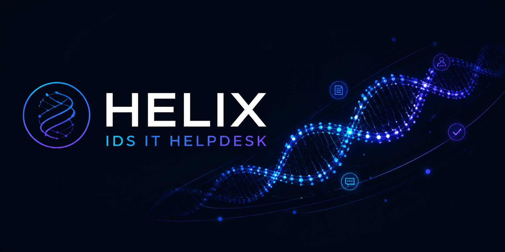
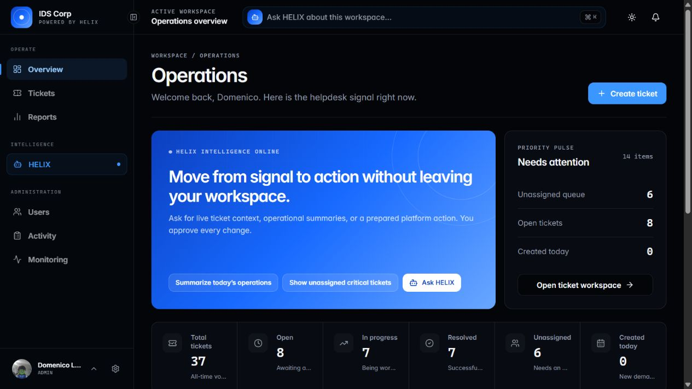
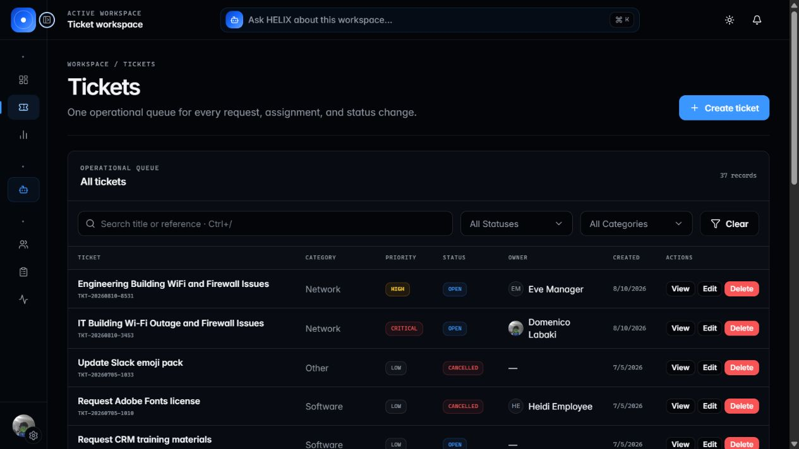
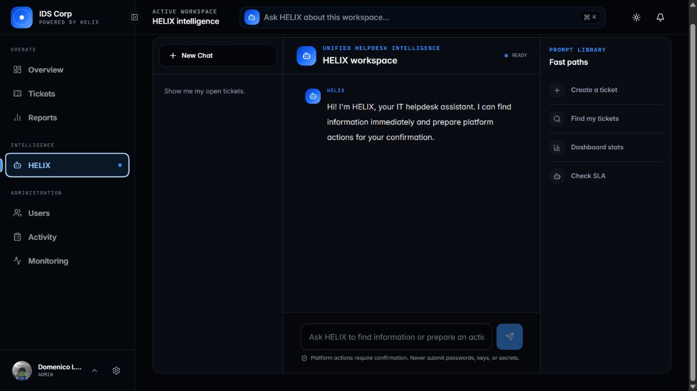

  

  <a href="#quick-start"><strong>Quick start</strong></a> ·
  <a href="#platform-capabilities"><strong>Features</strong></a> ·
  <a href="#how-helix-works"><strong>HELIX</strong></a> ·
  <a href="#architecture"><strong>Architecture</strong></a> ·
  <a href="#testing"><strong>Testing</strong></a>

  
  
  
  
  

# HELIX — IDS IT Helpdesk

HELIX is a self-hosted IT service management platform that brings ticketing, automation, reporting, and an approval-gated AI agent into one role-aware workspace.

Employees get a clear place to request help. Agents get one operational queue for triage, assignment, collaboration, and resolution. Managers get SLA and performance visibility. Administrators control users, configuration, audit history, and platform health.

The current **v1.0.0 HELIX release** moves beyond conventional ticket CRUD: the assistant can retrieve live helpdesk context and prepare allowed platform actions, while every write remains subject to explicit user confirmation and server-side authorization.

> This project was built during the IDS Full Stack Development Internship 2026. It is a complete portfolio application and a strong reference implementation; review the production checklist before using it in a live organization.

## Product tour

### Operations overview

<table>
  <tr>
    <td width="50%">
      
       
      <strong>Ticket workspace</strong> — searchable, filterable, role-aware operations queue.
    </td>
    <td width="50%">
      
       
      <strong>HELIX workspace</strong> — persistent conversations, live context, and confirmed actions.
    </td>
  </tr>
</table>

## What changed in v1.0.0

- **HELIX is now the intelligence layer across the product.** The full assistant workspace and floating assistant share the same sessions, messages, tool results, and pending actions.
- **AI writes are approval-gated.** HELIX prepares immutable, short-lived actions; the user confirms or rejects the exact operation before execution.
- **Agent responses link back to the platform.** Ticket and record results render as navigable application targets instead of disconnected text.
- **The workspace UI was rebuilt.** A denser sidebar, command-style HELIX entry point, operational top bar, dark/light themes, and responsive layouts give every role a focused home.
- **Prompt and data boundaries were hardened.** Role-specific tool allow-lists, strict argument schemas, bounded context, prompt-injection defenses, local authorization, and audit logging keep model output subordinate to application rules.

## Platform capabilities

| Area | What is included |
| --- | --- |
| Ticket operations | Create, view, update, delete, search, filter, sort, and paginate tickets; six statuses, six categories, four priorities, and generated references |
| Assignment and collaboration | Manual assignment/unassignment, automatic assignment, public comments, internal notes, attachments, status history, assignment history, and activity timelines |
| SLA and escalation | Priority-based deadlines, breach tracking, SLA compliance, configurable escalation rules, and a hosted escalation worker |
| HELIX intelligence | Category and priority suggestions, suggested replies, image attachment analysis, persistent chat sessions, SSE streaming, role-aware tools, linked results, and confirmed platform actions |
| Dashboards and reporting | Role-specific operational summaries, queue signals, Recharts analytics, agent performance, SLA reporting, and PDF/Excel exports |
| Notifications | Real-time in-app updates over SignalR plus configurable email templates for ticket events |
| Administration | User lifecycle management, role changes, account unlock, lookup management, SLA targets, escalation rules, email templates, system settings, maintenance mode, monitoring, backups, and activity logs |
| Identity and access | Four roles, JWT authentication, HTTP-only access and refresh cookies, token-version revocation, TOTP 2FA, account lockout, password recovery, and per-endpoint rate limits |

### Ticket reference data

| Type | Values |
| --- | --- |
| Status | Open, In Progress, Resolved, Closed, Cancelled, Pending |
| Priority | Low, Medium, High, Critical |
| Category | Hardware, Software, Network, Access Request, Other, Email |
| Default SLA | Critical: 4h · High: 8h · Medium: 24h · Low: 72h |

## Roles

There are exactly four application roles. Self-registration is disabled; administrators provision accounts.

| Role | Primary access |
| --- | --- |
| **Employee** | Create tickets, track their own requests, comment, attach files, receive notifications, and use HELIX within their visibility |
| **Agent** | Work the support queue, update status, assign tickets, add internal notes, and use staff HELIX actions |
| **Manager** | Monitor operations, review SLA and agent performance, and export reports |
| **Admin** | Full platform administration, monitoring, configuration, audit access, user management, and all ticket operations |

## How HELIX works

HELIX uses Groq's OpenAI-compatible API, but the model never receives direct access to the database or application credentials. All capabilities are local, allow-listed functions executed through existing backend services.

~~~mermaid
sequenceDiagram
    actor User
    participant UI as Next.js workspace
    participant API as ASP.NET Core API
    participant AI as Groq
    participant DB as PostgreSQL

    User->>UI: Ask for information or an action
    UI->>API: Authenticated SSE request
    API->>AI: Bounded context + tools allowed for role
    AI-->>API: Text or structured tool request
    API->>DB: Execute authorized read
    DB-->>API: Role-filtered result
    API-->>UI: Stream answer and linked records

    alt Write requested
        API->>DB: Store immutable pending action
        API-->>UI: Request explicit confirmation
        User->>UI: Confirm
        UI->>API: Confirm exact action ID
        API->>API: Recheck role, expiry, and arguments
        API->>DB: Execute once + write activity log
        API-->>UI: Stream completion result
    end
~~~

### HELIX capabilities by role

Read operations execute immediately and respect the same visibility rules as the rest of the API. Every write below requires confirmation.

| Capability | Employee | Agent | Manager | Admin |
| --- | :---: | :---: | :---: | :---: |
| Read visible tickets, dashboard stats, notifications, and lookup values | ✓ | ✓ | ✓ | ✓ |
| Suggest category and priority | ✓ | ✓ | ✓ | ✓ |
| View agent performance | — | — | ✓ | ✓ |
| Create or update a visible ticket; add a comment | Confirm | Confirm | Confirm | Confirm |
| Change ticket status or assign a ticket | — | Confirm | — | Confirm |
| Unassign a ticket | — | — | — | Confirm |

Ticket deletion and user/system administration are deliberately outside the agent's action scope.

For the detailed execution and trust model, see [docs/unified-agent.md](docs/unified-agent.md).

## Architecture

~~~mermaid
flowchart LR
    U["Employees · Agents · Managers · Admins"] --> FE["Next.js 16 React 19 · TypeScript · Tailwind"]
    FE <-->|"REST + HTTP-only cookies"| API["ASP.NET Core 10 Web API"]
    API --> SVC["Domain services tickets · auth · reports · AI"]
    SVC --> EF["EF Core 10"]
    EF --> DB[("PostgreSQL")]
    API -->|"SignalR"| FE
    API -->|"Backend-only HTTPS"| GROQ["Groq API"]
    API -->|"SMTP"| MAIL["Email provider"]
    WORKER["Escalation hosted service"] --> SVC
~~~

### Technology stack

| Layer | Technologies |
| --- | --- |
| Web application | Next.js 16 App Router, React 19, TypeScript 5, Tailwind CSS 4, shadcn/ui and Radix UI |
| Data and forms | TanStack Query 5, Axios, Zod 4, react-hook-form |
| Experience | Recharts, Lucide, Sonner, SignalR client, dark/light themes |
| API | ASP.NET Core 10, controllers, JWT Bearer auth, SignalR, hosted services |
| Persistence | PostgreSQL, EF Core 10, Npgsql, migrations and idempotent seeders |
| Security | BCrypt, Otp.NET, Data Protection, token versioning, rate limiting, role policies |
| AI | Groq chat completions, SSE streaming, local tool schemas, confirmation workflow, vision attachment analysis |
| Documents | QuestPDF and ClosedXML |
| Tests | xUnit, Moq, EF Core InMemory, coverlet |

## Quick start

### Prerequisites

- **Node.js 20.9 or newer**
- **.NET SDK 10**
- **PostgreSQL 12 or newer**
- EF Core CLI 10: <code>dotnet tool install --global dotnet-ef --version 10.*</code>
- A Groq API key only if you want HELIX and AI-assisted features

### 1. Clone the repository

~~~bash
git clone https://github.com/Domenico-Labaki/IDS-IT-helpdesk.git
cd IDS-IT-helpdesk
~~~

### 2. Configure the backend

Create <code>backend/.env</code>:

~~~dotenv
JwtSettings__Secret=replace-with-a-random-secret-at-least-32-characters
ConnectionStrings__DefaultConnection=Host=localhost;Port=5432;Database=helpdesk;Username=postgres;Password=postgres

# Optional: enables HELIX and AI suggestions
Groq__ApiKey=

# Optional deployment and integration settings
AllowedCorsOrigins=http://localhost:3000
Frontend__BaseUrl=http://localhost:3000
SmtpSettings__Host=
SmtpSettings__Port=587
SmtpSettings__Username=
SmtpSettings__Password=
SmtpSettings__FromEmail=
SmtpSettings__FromName=IDS IT Helpdesk
~~~

Environment files are ignored by Git. Do not commit real credentials.

### 3. Create and migrate the database

~~~bash
createdb helpdesk
cd backend
dotnet restore
dotnet ef database update
~~~

### 4. Configure the frontend

Create <code>frontend/.env.local</code>:

~~~dotenv
NEXT_PUBLIC_API_URL=http://localhost:5055/api
~~~

### 5. Start both applications

Backend:

~~~bash
cd backend
dotnet run
~~~

Frontend, in a second terminal:

~~~bash
cd frontend
npm ci
npm run dev
~~~

Open <http://localhost:3000>. Development Swagger UI is available at <http://localhost:5055/swagger>.

### Demo data

<code>backend/appsettings.Development.json</code> enables <code>SeedTestData</code> by default. On first development startup, the seeder creates users, tickets, histories, comments, attachments, notifications, settings, escalation rules, and AI session data.

All demo accounts use the password <code>Test@1234</code>.

| Role | Email |
| --- | --- |
| Admin | <code>admin@test.com</code> |
| Agent | <code>bob.agent@test.com</code> |
| Manager | <code>eve.manager@test.com</code> |
| Employee | <code>diana@test.com</code> |

> Demo credentials are development-only. Set <code>SeedTestData=false</code> and remove seeded accounts before any production deployment.

## Configuration notes

- The API runs on port **5055** and the frontend on port **3000** in the included development profiles.
- Access and refresh tokens are stored in HTTP-only, <code>SameSite=Strict</code> cookies.
- Production frontend and API deployments should share a site boundary, use HTTPS, and define exact CORS origins.
- HELIX is optional. The core helpdesk remains usable without <code>Groq__ApiKey</code>; AI endpoints will report that the provider is not configured.
- Outbound email is optional. Without SMTP settings, email delivery is unavailable while in-app SignalR notifications continue to work.
- Uploaded files, avatars, generated backups, environment files, and local logs are excluded from source control.

## Testing

Run backend tests:

~~~bash
cd backend
dotnet test tests/HelpdeskApi.Tests.csproj
~~~

Validate the frontend:

~~~bash
cd frontend
npm run lint
npm run build
~~~

If .NET reports duplicate assembly attributes after switching branches, remove generated <code>bin</code> and <code>obj</code> directories, then rebuild.

## Repository layout

~~~text
.
|-- backend/
|   |-- Controllers/       REST endpoints and authorization
|   |-- Data/              DbContext and seeders
|   |-- DTOs/              API contracts and HELIX tool schemas
|   |-- Migrations/        EF Core migration history
|   |-- Models/            Persistence entities
|   |-- Services/          Domain, reporting, escalation, and AI logic
|   |-- Hubs/              SignalR notification hub
|   |-- tests/             xUnit test project
|-- frontend/
|   |-- public/            Static web assets
|   |-- src/
|       |-- app/           Next.js App Router pages
|       |-- components/    Workspace and UI components
|       |-- hooks/         Client behavior
|       |-- lib/api/       Typed API clients
|       |-- types/         Shared TypeScript contracts
|-- docs/
|   |-- diagrams/          Architecture material
|   |-- images/            README branding and product captures
|   |-- schema/            ERD and SQL reference
|   |-- unified-agent.md   HELIX execution and security model
|-- README.md
~~~

## Production checklist

Before deploying this project beyond a local or demonstration environment:

- Generate a strong JWT secret and store all credentials in a managed secret store.
- Disable development seed data and replace all demo users.
- Serve the frontend and API over HTTPS behind a reverse proxy.
- Restrict CORS to the exact production origin.
- Apply migrations as a controlled release step and back up PostgreSQL.
- Configure SMTP, upload persistence, and retention policies for your environment.
- Use a dedicated Groq key, restrict backend egress to the provider, and review the data-handling requirements in [docs/unified-agent.md](docs/unified-agent.md).
- Review rate limits, SLA targets, escalation rules, maintenance settings, and email templates.
- Add centralized logs, health monitoring, and a production backup strategy.

## Current scope

- The knowledge-base module from the original requirements is not implemented.
- HELIX requires external Groq access; it is not an offline model.
- The repository does not currently include container or cloud deployment manifests.
- No open-source license has been selected yet. Until a license file is added, all rights remain with the repository owner.

## Author

Built by **Domenico Labaki** during the **IDS Internship 2026**.

Questions and bug reports can be opened in [GitHub Issues](https://github.com/Domenico-Labaki/IDS-IT-helpdesk/issues).
